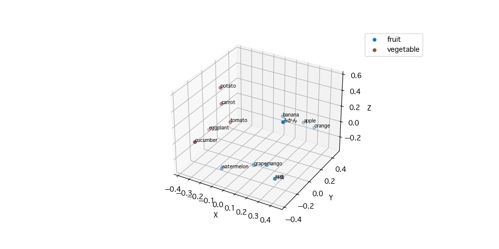

# openai-embedding-viewer
OpenAI で embedding した単語を3次元にして可視化するコード

## 準備
- `cp .env.template .env`
- <your_key> の部分を自分の OpenAI API Key に置き換える
- `poetry install` を実行する 

## 実行
- `python main.py`

## その他
- コードフォーマット
  - `poetry run task fmt`
